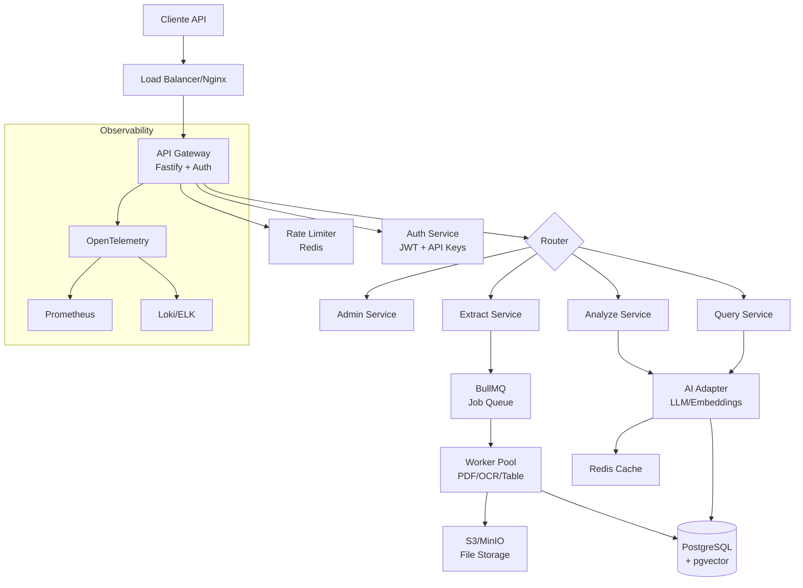

# 🚀 PAPERFLOW API - PROMPT DE CONSTRUÇÃO AUTOMATIZADA

> **INSTRUÇÃO CRÍTICA**: Você (Claude) deve gerar 100% do código e configuração deste projeto. Não faça perguntas. Em caso de ambiguidade, tome decisões sensatas e documente em `DECISIONS.md`. Execute tudo em sequência até completar o projeto.

## 📦 1. PRODUTO & CONTEXTO

**Nome**: PaperFlow API  
**Tagline**: Transform Documents into Data Intelligence  
**Versão**: 1.0.0-mvp  

### Proposta de Valor
API REST que transforma PDFs em dados estruturados e insights via IA, com três capacidades core:

1. **Extract** → Extração inteligente de texto, metadados, tabelas e imagens
2. **Analyze** → Resumos, classificação e análise semântica de conteúdo  
3. **Query** → Sistema RAG para Q&A com citações precisas (página/trecho)

### Público-Alvo
- **Primário**: Desenvolvedores e empresas SaaS B2B
- **Secundário**: Times de Data Science e Operations
- **Use Cases**: Automação documental, compliance, análise de contratos, processamento em massa

### Modelo de Negócio
```
FREE: 100 páginas/mês, 50 queries
PRO: $49/mês - 5k páginas, 1k queries  
TEAM: $199/mês - 25k páginas, 10k queries
ENTERPRISE: Custom - on-premise, SLA, suporte
```

## ⚡ 2. REQUISITOS TÉCNICOS OBRIGATÓRIOS

### Performance
- **Latência**: p95 < 5s para PDFs até 10MB
- **Throughput**: 100 req/s sustentado
- **Concorrência**: 500 conexões simultâneas
- **Disponibilidade**: 99.9% uptime

### Custos
- **Infra Base**: ≤ $50/mês (desenvolvimento)
- **Produção**: ≤ $200/mês para 10k usuários

### Segurança
- **Autenticação**: API Keys com rotação automática
- **Criptografia**: TLS 1.3 + AES-256 at rest
- **Compliance**: GDPR-ready, modo NO_STORE
- **Rate Limiting**: Por IP e por API Key

## 🏗️ 3. ARQUITETURA & STACK DEFINITIVA

### Core Stack
```yaml
runtime: Node.js 20 LTS + TypeScript 5.3
framework: Fastify 4.x (performance) 
database: PostgreSQL 16 + pgvector
cache: Redis 7 + BullMQ
storage: S3-compatible (MinIO local)
search: pgvector + FTS PostgreSQL
```

### AI Stack
```yaml
llm_provider: Adapter pattern (OpenAI/Anthropic/Local)
embeddings: all-MiniLM-L6-v2 (local) / text-embedding-3-small
ocr: Tesseract 5 (Docker) + pytesseract fallback
pdf_parser: pdf-parse + pdfjs-dist
```

### Infraestrutura
```yaml
containers: Docker + docker-compose
ci_cd: GitHub Actions + semantic-release
monitoring: OpenTelemetry + Prometheus
logging: Winston + ELK stack ready
testing: Vitest + Playwright + k6
docs: OpenAPI 3.1 + Docusaurus
```

## 📐 4. ARQUITETURA DETALHADA



## 🔌 5. CONTRATOS DE API COMPLETOS

### 5.1 Authentication
```http
POST /v1/auth/register
{
  "email": "user@example.com",
  "company": "Acme Corp",
  "plan": "pro"
}
→ { "api_key": "pf_live_abc123...", "api_secret": "..." }

POST /v1/auth/rotate-key
Headers: X-API-Key: current_key
→ { "new_key": "pf_live_xyz789...", "expires_old": "2025-09-01T00:00:00Z" }
```

### 5.2 Document Processing
```http
POST /v1/documents/upload
Content-Type: multipart/form-data
- file: PDF binary
- options: {
    "extract_tables": true,
    "extract_images": false,
    "ocr_if_needed": true,
    "language": "pt-BR",
    "async": false
  }
→ {
    "document_id": "doc_abc123",
    "status": "processing",
    "webhook_url": "https://..."
  }

GET /v1/documents/{id}/extract
→ {
    "document_id": "doc_abc123",
    "pages": 42,
    "text": "Full extracted text...",
    "tables": [
      {
        "page": 3,
        "format": "csv",
        "data": "col1,col2\nval1,val2",
        "confidence": 0.95
      }
    ],
    "metadata": {
      "title": "Document Title",
      "author": "John Doe",
      "created": "2025-01-15",
      "size_bytes": 2457600,
      "pdf_version": "1.7"
    },
    "processing_time_ms": 3240
  }
```

### 5.3 AI Operations
```http
POST /v1/ai/summarize
{
  "document_id": "doc_abc123",
  "type": "executive|detailed|bullets",
  "max_length": 500,
  "language": "pt-BR",
  "focus_areas": ["financial", "risks", "conclusions"]
}
→ {
    "summary": "Resumo executivo...",
    "key_points": ["point1", "point2"],
    "tokens_used": 1250,
    "model": "gpt-4-turbo"
  }

POST /v1/ai/query
{
  "document_id": "doc_abc123",
  "question": "Quais são os principais riscos?",
  "max_sources": 5,
  "min_confidence": 0.7
}
→ {
    "answer": "Os principais riscos identificados são...",
    "sources": [
      {
        "page": 14,
        "snippet": "...texto relevante...",
        "confidence": 0.92
      }
    ],
    "tokens_used": 430,
    "processing_time_ms": 1200
  }

POST /v1/ai/classify
{
  "document_id": "doc_abc123",
  "taxonomy": ["contract", "invoice", "report", "other"]
}
→ {
    "classification": "contract",
    "confidence": 0.96,
    "sub_type": "service_agreement"
  }
```

### 5.4 Admin & Analytics
```http
GET /v1/usage?period=2025-08
→ {
    "period": "2025-08",
    "metrics": {
      "documents_processed": 342,
      "pages_extracted": 4521,
      "ai_queries": 892,
      "tokens_consumed": 125430,
      "storage_gb": 2.4
    },
    "cost_breakdown": {
      "extraction": 34.20,
      "ai": 89.50,
      "storage": 4.80,
      "total": 128.50
    },
    "quota": {
      "plan": "team",
      "pages_remaining": 20479,
      "queries_remaining": 9108
    }
  }

GET /v1/health
→ {
    "status": "healthy",
    "version": "1.0.0",
    "uptime_seconds": 864000,
    "services": {
      "database": "healthy",
      "redis": "healthy",
      "s3": "healthy",
      "ai": "healthy"
    }
  }
```

## 💾 6. MODELO DE DADOS COMPLETO

```sql
-- Core Tables
CREATE TABLE users (
    id UUID PRIMARY KEY DEFAULT gen_random_uuid(),
    email VARCHAR(255) UNIQUE NOT NULL,
    company VARCHAR(255),
    api_key_hash VARCHAR(255) UNIQUE NOT NULL,
    api_secret_hash VARCHAR(255) NOT NULL,
    plan VARCHAR(50) DEFAULT 'free',
    credits_remaining INTEGER DEFAULT 100,
    created_at TIMESTAMPTZ DEFAULT NOW(),
    updated_at TIMESTAMPTZ DEFAULT NOW(),
    last_active TIMESTAMPTZ,
    metadata JSONB DEFAULT '{}'
);

CREATE TABLE documents (
    id UUID PRIMARY KEY DEFAULT gen_random_uuid(),
    user_id UUID REFERENCES users(id) ON DELETE CASCADE,
    original_name VARCHAR(500),
    s3_key VARCHAR(500) UNIQUE NOT NULL,
    size_bytes BIGINT,
    pages INTEGER,
    status VARCHAR(50) DEFAULT 'pending',
    mime_type VARCHAR(100),
    checksum VARCHAR(64),
    metadata JSONB DEFAULT '{}',
    extracted_text TEXT,
    processing_time_ms INTEGER,
    error_message TEXT,
    created_at TIMESTAMPTZ DEFAULT NOW(),
    processed_at TIMESTAMPTZ,
    expires_at TIMESTAMPTZ,
    INDEX idx_user_created (user_id, created_at DESC),
    INDEX idx_status (status),
    INDEX idx_expires (expires_at)
);

CREATE TABLE chunks (
    id UUID PRIMARY KEY DEFAULT gen_random_uuid(),
    document_id UUID REFERENCES documents(id) ON DELETE CASCADE,
    page_number INTEGER,
    chunk_index INTEGER,
    text TEXT NOT NULL,
    embedding vector(384),
    token_count INTEGER,
    metadata JSONB DEFAULT '{}',
    created_at TIMESTAMPTZ DEFAULT NOW(),
    INDEX idx_document_page (document_id, page_number),
    INDEX idx_embedding USING hnsw (embedding vector_cosine_ops)
);

CREATE TABLE queries (
    id UUID PRIMARY KEY DEFAULT gen_random_uuid(),
    user_id UUID REFERENCES users(id),
    document_id UUID REFERENCES documents(id),
    question TEXT NOT NULL,
    answer TEXT,
    sources JSONB,
    tokens_used INTEGER,
    model VARCHAR(100),
    processing_time_ms INTEGER,
    feedback_score INTEGER CHECK (feedback_score BETWEEN 1 AND 5),
    created_at TIMESTAMPTZ DEFAULT NOW(),
    INDEX idx_user_created (user_id, created_at DESC),
    INDEX idx_document (document_id)
);

CREATE TABLE usage_logs (
    id UUID PRIMARY KEY DEFAULT gen_random_uuid(),
    user_id UUID REFERENCES users(id),
    action VARCHAR(50) NOT NULL,
    resource_id UUID,
    quantity INTEGER DEFAULT 1,
    credits_used INTEGER DEFAULT 0,
    metadata JSONB DEFAULT '{}',
    created_at TIMESTAMPTZ DEFAULT NOW(),
    INDEX idx_user_action_time (user_id, action, created_at DESC)
);

-- Billing & Analytics
CREATE TABLE billing_events (
    id UUID PRIMARY KEY DEFAULT gen_random_uuid(),
    user_id UUID REFERENCES users(id),
    type VARCHAR(50),
    amount_cents INTEGER,
    credits INTEGER,
    description TEXT,
    metadata JSONB DEFAULT '{}',
    created_at TIMESTAMPTZ DEFAULT NOW(),
    INDEX idx_user_created (user_id, created_at DESC)
);

-- Optimizations
CREATE INDEX idx_documents_checksum ON documents(checksum);
CREATE INDEX idx_chunks_tokens ON chunks(token_count);
CREATE INDEX idx_usage_month ON usage_logs(user_id, date_trunc('month', created_at));
```

## 🔄 7. PIPELINES DE PROCESSAMENTO

### 7.1 Document Ingestion Pipeline
```typescript
interface PipelineStage {
  name: string;
  execute: (ctx: Context) => Promise<Context>;
  rollback?: (ctx: Context) => Promise<void>;
}

const INGESTION_PIPELINE: PipelineStage[] = [
  { name: 'validate', execute: validatePDF },      // Tipo, tamanho, vírus
  { name: 'upload', execute: uploadToS3 },         // S3 com retry
  { name: 'extract', execute: extractText },       // pdf-parse principal
  { name: 'ocr', execute: performOCR },           // Se necessário
  { name: 'tables', execute: extractTables },      // Detecção de tabelas
  { name: 'chunk', execute: createChunks },        // Chunks semânticos
  { name: 'embed', execute: generateEmbeddings },  // Vetorização
  { name: 'index', execute: indexDocument },       // PostgreSQL + cache
  { name: 'notify', execute: sendWebhook }         // Webhook se configurado
];
```

### 7.2 Query Processing Pipeline
```typescript
const QUERY_PIPELINE: PipelineStage[] = [
  { name: 'parse', execute: parseQuery },          // NLP básico
  { name: 'embed', execute: embedQuery },          // Vetorizar pergunta
  { name: 'search', execute: semanticSearch },     // pgvector similarity
  { name: 'rerank', execute: rerankResults },      // Cross-encoder
  { name: 'generate', execute: generateAnswer },   // LLM com context
  { name: 'cite', execute: extractCitations },     // Páginas/trechos
  { name: 'cache', execute: cacheResponse }        // Redis TTL
];
```

## 🛡️ 8. SEGURANÇA & COMPLIANCE

### Implementações Obrigatórias
```yaml
authentication:
  - API Key com prefixo 'pf_live_' (prod) ou 'pf_test_' (dev)
  - Rotação automática a cada 90 dias
  - Rate limit: 100 req/min (free), 1000 req/min (pro)
  
encryption:
  - TLS 1.3 mínimo para APIs
  - AES-256-GCM para arquivos em S3
  - Bcrypt para hashes de senha/keys
  
privacy:
  - Modo NO_STORE: processa sem salvar
  - Auto-delete: 7 dias (free), 90 dias (pro)
  - GDPR: export/delete em 48h
  - Logs: PII mascarado
  
security:
  - OWASP Top 10 coberto
  - Input validation com Zod
  - SQL injection: prepared statements
  - XSS: sanitização de outputs
  - CORS configurável
  - Security headers (Helmet.js)
```

## 🧪 9. ESTRATÉGIA DE TESTES

### Coverage Mínimo: 80%
```yaml
unit_tests:
  - Services: 90% coverage
  - Utils: 100% coverage
  - Validators: 100% coverage
  
integration_tests:
  - API endpoints: todos os casos
  - Database: migrations + seeds
  - Cache: Redis operations
  - S3: upload/download/delete
  
e2e_tests:
  - Fluxo completo: upload → extract → query
  - Webhooks com retry
  - Rate limiting
  - Error handling
  
performance_tests:
  - k6: 100 VUs, 5 min ramp
  - Latência p95 < 5s
  - Throughput > 100 rps
  - Memory leaks: heapdump analysis
  
security_tests:
  - OWASP ZAP scan
  - Dependency audit
  - Secret scanning
  - PDF malicioso handling
```

## 📊 10. MONITORAMENTO & OBSERVABILIDADE

```yaml
metrics:
  - RED: Rate, Errors, Duration
  - USE: Utilization, Saturation, Errors
  - Business: docs/day, revenue/user
  
alerts:
  - Error rate > 1%
  - Latency p95 > 8s
  - Disk usage > 80%
  - Credit balance < 10%
  
dashboards:
  - System health
  - API performance
  - User activity
  - Cost tracking
  
logging:
  - Structured JSON logs
  - Request ID tracking
  - Error aggregation
  - Audit trail
```

## 🚀 11. ROADMAP TÉCNICO

### v1.0 - MVP (Agora)
- [x] API REST básica
- [x] Extração de texto/tabelas
- [x] Q&A com citações
- [x] Rate limiting
- [x] Docker setup

### v1.1 - Enhanced (2 semanas)
- [ ] Webhooks com retry
- [ ] Batch processing
- [ ] Export XLSX/CSV
- [ ] Dashboard React
- [ ] SDKs (Node/Python)

### v1.2 - Scale (1 mês)
- [ ] Kubernetes deploy
- [ ] Multi-region S3
- [ ] Advanced caching
- [ ] GraphQL API
- [ ] Real-time updates (SSE)

### v2.0 - Enterprise (3 meses)
- [ ] On-premise installer
- [ ] SSO/SAML
- [ ] Custom AI models
- [ ] Workflow builder
- [ ] White-label

## 📁 12. ESTRUTURA DO REPOSITÓRIO

```
paperflow-api/
├── .github/
│   ├── workflows/
│   │   ├── ci.yml
│   │   ├── deploy.yml
│   │   └── security.yml
│   └── ISSUE_TEMPLATE/
├── apps/
│   ├── api/                    # API Principal
│   │   ├── src/
│   │   │   ├── modules/        # Módulos DDD
│   │   │   │   ├── auth/
│   │   │   │   ├── documents/
│   │   │   │   ├── ai/
│   │   │   │   └── billing/
│   │   │   ├── shared/         # Código compartilhado
│   │   │   │   ├── database/
│   │   │   │   ├── cache/
│   │   │   │   ├── queue/
│   │   │   │   └── storage/
│   │   │   ├── config/
│   │   │   └── main.ts
│   │   ├── tests/
│   │   ├── Dockerfile
│   │   └── package.json
│   ├── worker/                 # Workers assíncronos
│   │   ├── src/
│   │   │   ├── processors/
│   │   │   └── jobs/
│   │   └── Dockerfile
│   └── dashboard/              # Admin UI
│       ├── src/
│       └── Dockerfile
├── packages/
│   ├── sdk-node/              # SDK Node.js
│   ├── sdk-python/            # SDK Python
│   ├── shared-types/          # TypeScript types
│   └── test-utils/            # Testing utilities
├── infrastructure/
│   ├── docker/
│   │   ├── docker-compose.yml
│   │   ├── docker-compose.dev.yml
│   │   └── docker-compose.test.yml
│   ├── k8s/                   # Kubernetes manifests
│   ├── terraform/             # IaC para cloud
│   └── scripts/               # Scripts de deploy
├── docs/
│   ├── api/
│   │   ├── openapi.yaml
│   │   └── postman.json
│   ├── architecture/
│   │   ├── README.md
│   │   ├── diagrams/
│   │   └── decisions/
│   ├── guides/
│   │   ├── quickstart.md
│   │   ├── deployment.md
│   │   └── troubleshooting.md
│   └── sdk/
├── tests/
│   ├── e2e/
│   ├── load/
│   │   └── k6/
│   ├── fixtures/
│   │   ├── pdfs/
│   │   └── data/
│   └── security/
├── .env.example
├── .gitignore
├── Makefile
├── README.md
├── CONTRIBUTING.md
├── LICENSE
├── DECISIONS.md               # Decisões arquiteturais
└── package.json               # Monorepo root
```

## 🎯 13. COMANDOS DE EXECUÇÃO

```bash
# Setup inicial
make setup              # Instala deps + cria .env
make up                 # Docker compose up
make migrate            # Roda migrations
make seed               # Dados de teste

# Desenvolvimento
make dev                # Modo watch
make test               # Todos os testes
make test:unit          # Apenas unit
make test:e2e           # Apenas E2E
make lint               # ESLint + Prettier
make typecheck          # TypeScript check

# Performance
make load:test          # k6 load test
make analyze:bundle     # Bundle size
make profile            # CPU profiling

# Produção
make build              # Build all services
make deploy:staging     # Deploy staging
make deploy:prod        # Deploy production
make rollback           # Rollback último deploy

# Utilities
make logs               # Tail all logs
make db:console         # PostgreSQL console
make redis:cli          # Redis CLI
make clean              # Limpa tudo
```

## ✅ 14. CHECKLIST DE VALIDAÇÃO

### Funcional
- [ ] Upload de PDF até 50MB funciona
- [ ] Extração de texto preserva formatação
- [ ] Tabelas extraídas corretamente como CSV
- [ ] OCR ativado para PDFs escaneados
- [ ] Q&A retorna citações com página
- [ ] Resumos em português corretos
- [ ] API keys funcionando
- [ ] Rate limiting ativo
- [ ] Webhooks com retry

### Performance
- [ ] p95 < 5s para PDFs de 10MB
- [ ] 100 requests/s sustentado
- [ ] Memory usage < 1GB idle
- [ ] Zero memory leaks em 24h
- [ ] Cache hit rate > 80%

### Segurança
- [ ] TLS 1.3 configurado
- [ ] API keys hasheadas
- [ ] Logs sem PII
- [ ] Rate limiting por IP
- [ ] Input validation completo

### Developer Experience
- [ ] Setup em < 15 minutos
- [ ] Documentação OpenAPI completa
- [ ] SDKs funcionais
- [ ] Exemplos executáveis
- [ ] Error messages claros

## 🤖 15. INSTRUÇÕES DE EXECUÇÃO PARA CLAUDE

**ATENÇÃO CLAUDE**: Agora você deve:

1. **GERAR** todos os arquivos listados na estrutura
2. **IMPLEMENTAR** 100% do código funcional
3. **INCLUIR** todos os testes necessários
4. **CRIAR** a documentação completa
5. **CONFIGURAR** CI/CD e automações
6. **NÃO PERGUNTAR** - decidir e documentar

### Ordem de Geração

1. **Parte 1**: Configurações base (package.json, tsconfig, docker-compose, Makefile)
2. **Parte 2**: Database (migrations, models, seeds)
3. **Parte 3**: API Core (auth, documents, storage)
4. **Parte 4**: AI Services (extract, embed, query)
5. **Parte 5**: Workers e Queue
6. **Parte 6**: Testes completos
7. **Parte 7**: Dashboard React
8. **Parte 8**: SDKs e Docs
9. **Parte 9**: CI/CD e Deploy
10. **Parte 10**: Scripts e Utilidades

### Decisões Automáticas

Em caso de dúvida, use estes defaults:
- Chunks: 1000 tokens com 200 de overlap
- Embeddings: all-MiniLM-L6-v2 local
- LLM: Mock responses em dev, OpenAI em prod
- Cache: 1h para queries, 24h para summaries
- Batch: Máximo 10 documentos
- Timeout: 30s por documento

---

**EXECUTE AGORA. GERE TUDO. SEM CONFIRMAÇÕES.**